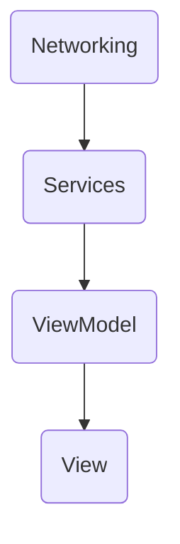

# Challenge Mobile App
**Survey Application** provides users with survey browsing visually appealing home screen featuring survey card, the intuitive interface allows seamless horizontal scrolling through surveys, with a dynamic navigation indicator, and additional features such as secure login, options for logout, email-based password recovery and profile viewing, enhancing user interaction and convenience. The app employs efficient data caching techniques, optimizing performance.

## Table of Contents
- [🚀 Environment setup](#-environment-setup)
  - [🌍 Project Specifications](#-project-specifications)
  - [🧱 Dependencies](#-dependencies)
- [🤔 About the project](#-about-the-project)
  - [🗂 Folder Structure](#-folder-structure)
  - [📦 Dependency Injection](#-dependency-injection)
  - [🔌 App Communication](#-app-communication)
  - [🛠 Resources](#-resources)
  
## 🚀 Environment setup

### 🌍 Project Specifications
1. Xcode 13+
2. iOS 10+
3. Swift 5
5. MVVM
6. Cocoa Pods
7. Fastlane

### 🧱 Dependencies
1. [Swinject](https://github.com/Swinject/Swinject) a Dependency Injection framework
2. [Moya](https://github.com/Moya/Moya) a Network abstraction layer framework
3. [Kingfisher](https://github.com/onevcat/Kingfisher) a pure-Swift library for downloading and caching images from the web
4. [FlowStacks](https://github.com/onevcat/Kingfisher) allow you to manage complex SwiftUI navigation and presentation flows with a simple array

## 🤔 About the project

### 🗂 Folder Structure

```swift
ChallengeMobileApp
|-- Domain
|   -- Repository
|   -- UseCase
|   -- Entities //DTOs
|-- SupportingFiles
|-- Data
|   -- Network 
|       -- Repository
|       -- Service
|       -- Response
|       -- Request
|       -- Error
|-- App
|   -- Storage
|   -- Coordinator // Navigation
|   -- Utilities
|   -- Extensions
|-- Dependencies // Dependencies Registrations into a DI Container
|-- Presentation // App Screens with SwiftUI
|   -- Home 
|   -- ViewModel 
```

### 📦 Dependency Injection

For Service Registration the project uses Swinject `Library/Dependencies/Injector.swift`

```swift
enum Injector {
    static let sharedAssambler: Assembler = {
        let container = Container()
        let assambler = Assembler(
            [
                ServiceAssembly()
            ],
            container: container
        )
        return assambler
    }()
}
```
* `ServiceAssembly` Services registrations

### 🔌 App Communication


### 🛠 Resources

**Design:**
- The UI for the mobile application is available on [Figma](https://www.figma.com/file/GjRPOjDyZ6f4EDL3wKarRK/Challenge---Mobile-App?node-id=0%3A1&mode=dev).

**API Documentation:**
- Refer to the [API documentation](https://survey-api.nimblehq.co/api/docs/openapi#/) for detailed information about the endpoints, data structures, and authentication methods.
